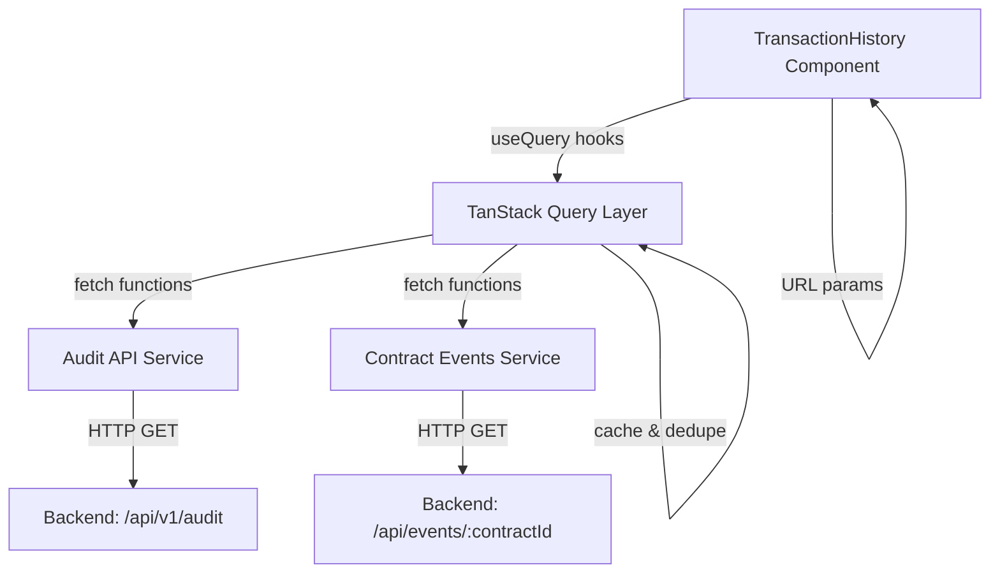

# Design Document: Transaction History Backend Integration

## Overview

This design document specifies the integration of the TransactionHistory.tsx component with the backend audit API and contract event indexer. The implementation replaces the current stub-based data fetching with TanStack Query-powered API integration, implements server-side filtering with debouncing, merges contract events with Stellar transactions into a unified timeline, and provides robust error handling with retry functionality.

### Goals

- Replace stub data fetching with real API calls to `/api/v1/audit` and `/api/events/{contractId}`
- Implement TanStack Query for data fetching, caching, and state management
- Support server-side pagination with "Load More" functionality
- Implement debounced server-side filtering for date range, status, employee, and asset
- Merge contract events from multiple contracts with Stellar transactions in chronological order
- Provide loading states, empty states, and error handling with retry
- Persist filter state in URL query parameters for bookmarking and sharing
- Optimize performance through caching and request deduplication

### Non-Goals

- Infinite scroll implementation (using "Load More" button instead)
- Real-time updates via WebSocket (future enhancement)
- Advanced analytics or data visualization
- Export functionality for transaction history

## Architecture

### High-Level Architecture



### Data Flow

1. **Component Mount**: TransactionHistory component mounts and reads URL query parameters
2. **Initial Query**: TanStack Query triggers initial data fetch with filters from URL
3. **API Calls**: Parallel requests to audit API and contract events API
4. **Data Merging**: Responses are normalized and merged into unified timeline
5. **Rendering**: Component displays merged, sorted timeline items
6. **Filter Changes**: User modifies filters → debounce → URL update → query invalidation → refetch
7. **Pagination**: User clicks "Load More" → fetch next page → append to existing data
8. **Error Handling**: API errors trigger error state with retry button

### Component Structure

```
TransactionHistory (Page Component)
├── FilterPanel (UI Section)
│   ├── SearchInput
│   ├── StatusSelect
│   ├── EmployeeInput
│   ├── AssetInput
│   ├── DateRangeInputs
│   └── ClearFiltersButton
├── TimelineDisplay (UI Section)
│   ├── LoadingSkeleton
│   ├── EmptyState
│   ├── ErrorState (with retry)
│   └── TimelineItemList
│       └── TimelineItem (Classic or Contract)
└── LoadMoreButton
```

## Components and Interfaces

### 1. Custom Hooks

#### useTransactionHistory

Primary hook for fetching and managing transaction history data.

```typescript
interface UseTransactionHistoryOptions {
  filters: HistoryFilters;
  page: number;
  limit: number;
}

interface UseTransactionHistoryResult {
  data: TimelineItem[] | undefined;
  isLoading: boolean;
  isLoadingMore: boolean;
  error: Error | null;
  hasMore: boolean;
  fetchNextPage: () => void;
  retry: () => void;
}

function useTransactionHistory(
  options: UseTransactionHistoryOptions,
): UseTransactionHistoryResult;
```

**Implementation Strategy**:

- Use `useQuery` from TanStack Query for initial page
- Use `useInfiniteQuery` for pagination support
- Query key includes all filter parameters for proper cache invalidation
- Implements parallel fetching of audit and contract event data
- Merges and sorts results client-side

#### useFilterState

Hook for managing filter state with URL synchronization.

```typescript
interface UseFilterStateResult {
  filters: HistoryFilters;
  debouncedFilters: HistoryFilters;
  updateFilter: (key: keyof HistoryFilters, value: string) => void;
  resetFilters: () => void;
  activeFilterCount: number;
}

function useFilterState(): UseFilterStateResult;
```

**Implementation Strategy**:

- Reads initial state from URL query parameters
- Debounces filter changes (300ms)
- Updates URL when debounced filters change
- Provides helper for counting active filters

### 2. API Service Layer

#### transactionHistoryApi.ts

Service module for API communication.

```typescript
// Audit API
interface FetchAuditOptions {
  page: number;
  limit: number;
  status?: string;
  employee?: string;
  asset?: string;
  startDate?: string;
  endDate?: string;
  search?: string;
}

interface AuditApiResponse {
  data: AuditRecord[];
  total: number;
  page: number;
  totalPages: number;
}

async function fetchAuditRecords(
  options: FetchAuditOptions,
): Promise<AuditApiResponse>;

// Contract Events API
interface FetchContractEventsOptions {
  contractId: string;
  page: number;
  limit: number;
  eventType?: string;
  category?: string;
}

interface ContractEventsApiResponse {
  success: boolean;
  data: ContractEvent[];
  pagination: {
    page: number;
    limit: number;
    total: number;
    totalPages: number;
  };
}

async function fetchContractEvents(
  options: FetchContractEventsOptions,
): Promise<ContractEventsApiResponse>;

// Unified fetch
interface FetchHistoryPageOptions {
  page: number;
  limit: number;
  filters: HistoryFilters;
}

interface FetchHistoryPageResult {
  items: TimelineItem[];
  hasMore: boolean;
  total: number;
}

async function fetchHistoryPage(
  options: FetchHistoryPageOptions,
): Promise<FetchHistoryPageResult>;
```

**Implementation Details**:

- `fetchAuditRecords`: Calls `/api/v1/audit` with query parameters
- `fetchContractEvents`: Calls `/api/events/{contractId}` for each contract
- `fetchHistoryPage`: Orchestrates parallel calls, normalizes data, merges results
- Error handling with typed error responses
- Request cancellation support via AbortController

### 3. Data Normalization

#### Normalizer Functions

```typescript
function normalizeAuditRecord(record: AuditRecord): TimelineItem;
function normalizeContractEvent(
  event: ContractEvent,
  contractId: string,
): TimelineItem;
function mergeAndSortTimeline(items: TimelineItem[]): TimelineItem[];
```

**Normalization Rules**:

- Audit records → `kind: 'classic'`, status based on `successful` field
- Contract events → `kind: 'contract'`, status always `'indexed'`
- Timestamps converted to ISO 8601 strings
- Amounts formatted with proper decimal precision
- Missing fields filled with sensible defaults

## Data Models

### Frontend Models

```typescript
interface HistoryFilters {
  search: string; // Transaction hash or actor search
  status: string; // 'confirmed' | 'pending' | 'failed' | ''
  employee: string; // Employee name or wallet address
  asset: string; // Asset code (e.g., 'USDC', 'XLM')
  startDate: string; // ISO date string
  endDate: string; // ISO date string
}

interface TimelineItem {
  id: string; // Unique identifier
  kind: "classic" | "contract";
  createdAt: string; // ISO 8601 timestamp
  status: string; // 'confirmed' | 'pending' | 'failed' | 'indexed'
  amount: string; // Formatted amount string
  asset: string; // Asset code
  actor: string; // Source account or contract ID
  txHash: string | null; // Transaction hash (null for some events)
  label: string; // Display label
  badge: string; // Badge text ('Classic' | 'Contract Event')
}
```

### Backend API Models

```typescript
// Audit API Response
interface AuditRecord {
  id: number;
  tx_hash: string;
  source_account: string;
  fee_charged: string;
  successful: boolean;
  created_at: string;
  stellar_created_at: string;
  // ... other fields
}

// Contract Events API Response
interface ContractEvent {
  event_id: string;
  contract_id: string;
  event_type: string;
  payload: {
    amount?: string;
    asset_code?: string;
    // ... other payload fields
  };
  ledger_sequence: number;
  tx_hash: string;
  created_at: string;
}
```

### Query Keys

TanStack Query cache keys follow this structure:

```typescript
// Transaction history query key
const transactionHistoryKey = [
  'transactionHistory',
  {
    page: number,
    limit: number,
    filters: HistoryFilters
  }
] as const;

// Audit records query key
const auditRecordsKey = [
  'auditRecords',
  {
    page: number,
    limit: number,
    status?: string,
    employee?: string,
    asset?: string,
    startDate?: string,
    endDate?: string,
    search?: string
  }
] as const;

// Contract events query key
const contractEventsKey = [
  'contractEvents',
  {
    contractId: string,
    page: number,
    limit: number
  }
] as const;
```

## Correctness Properties

_A property is a characteristic or behavior that should hold true across all valid executions of a system—essentially, a formal statement about what the system should do. Properties serve as the bridge between human-readable specifications and machine-verifiable correctness guarantees._

### Property 1: API Data Display

_For any_ valid API response containing transaction data, the component should render all items from that response in the timeline.

**Validates: Requirements 1.2**

### Property 2: Error State Display

_For any_ API error response (4xx, 5xx, or network error), the component should display an appropriate error message categorized by error type.

**Validates: Requirements 1.3, 10.1, 10.2, 10.3**

### Property 3: Pagination Parameters

_For any_ data fetch operation, the API request should include page number and page size parameters.

**Validates: Requirements 2.1**

### Property 4: Page Increment on Load More

_For any_ load more action, the next fetch should request page number incremented by 1.

**Validates: Requirements 2.2**

### Property 5: Data Accumulation

_For any_ load more operation, the new items should be appended to the existing items array without replacing previous results.

**Validates: Requirements 2.5**

### Property 6: Filter Debouncing

_For any_ filter value change, the API request should be delayed by at least 300 milliseconds.

**Validates: Requirements 3.1, 7.1**

### Property 7: Pagination Reset on Filter Change

_For any_ filter parameter change, the pagination state should reset to page 1.

**Validates: Requirements 3.2**

### Property 8: Filter Parameters in Request

_For any_ active filter values (status, employee, asset, date range, search), those values should be included as query parameters in the API request.

**Validates: Requirements 3.3, 3.4, 3.5, 3.6, 3.7**

### Property 9: Multiple Filters Combined

_For any_ combination of multiple active filters, all filter parameters should be present in the API request simultaneously.

**Validates: Requirements 3.8**

### Property 10: Dual API Calls

_For any_ transaction history fetch operation, both the audit API and contract events API should be called.

**Validates: Requirements 4.1**

### Property 11: Timeline Merging and Sorting

_For any_ set of audit records and contract events, the merged timeline should contain all items sorted by timestamp in descending order.

**Validates: Requirements 4.2, 4.3**

### Property 12: Contract Event Badge Differentiation

_For any_ contract event item in the timeline, it should display a badge value different from classic transaction items.

**Validates: Requirements 4.4**

### Property 13: Loading State Visibility

_For any_ loading state (initial or pagination), the appropriate loading indicator should be visible, and when loading completes, all loading indicators should be hidden.

**Validates: Requirements 5.1, 5.2, 5.3**

### Property 14: Cache Hit on Repeated Query

_For any_ query with identical parameters executed multiple times, subsequent executions should return cached results without making new API calls.

**Validates: Requirements 7.2**

### Property 15: Request Cancellation on Unmount

_For any_ in-flight API request when the component unmounts, that request should be cancelled.

**Validates: Requirements 7.3**

### Property 16: Request Deduplication

_For any_ concurrent requests with identical parameters, only one actual API call should be made.

**Validates: Requirements 7.4**

### Property 17: URL Synchronization

_For any_ filter parameter change, the URL query parameters should be updated to reflect the new filter state.

**Validates: Requirements 8.1**

### Property 18: URL Hydration

_For any_ component mount with URL query parameters present, those parameters should be used as the initial filter values.

**Validates: Requirements 8.2**

### Property 19: History Navigation State Restoration

_For any_ browser back/forward navigation, the filter state should be restored from the URL parameters.

**Validates: Requirements 8.3**

### Property 20: URL Encoding

_For any_ filter value containing special characters, the URL query parameter should be properly encoded.

**Validates: Requirements 8.4**

### Property 21: Required Field Display

_For any_ timeline item (classic or contract), all required fields for that item type should be present in the rendered output.

**Validates: Requirements 9.1, 9.2**

### Property 22: Amount Formatting

_For any_ transaction amount displayed, it should be formatted according to the asset's decimal precision.

**Validates: Requirements 9.3**

### Property 23: Timestamp Localization

_For any_ timestamp displayed, it should be formatted in the user's local timezone.

**Validates: Requirements 9.4**

### Property 24: Status Visual Indicators

_For any_ transaction status value (confirmed, pending, failed, indexed), the corresponding visual indicator should be displayed.

**Validates: Requirements 9.5**

### Property 25: Retry Availability

_For any_ error state, a retry action should be available to the user.

**Validates: Requirements 10.4**

### Property 26: Retry Execution

_For any_ retry action triggered, the same query with the same parameters should be re-executed.

**Validates: Requirements 10.5**

## Error Handling

### Error Categories

1. **Network Errors**: Connection failures, timeouts, DNS resolution failures
2. **Client Errors (4xx)**: Invalid parameters, authentication failures, not found
3. **Server Errors (5xx)**: Backend service failures, database errors
4. **Data Validation Errors**: Malformed responses, missing required fields

### Error Handling Strategy

```typescript
interface ErrorState {
  type: "network" | "client" | "server" | "validation";
  message: string;
  statusCode?: number;
  retryable: boolean;
}

function categorizeError(error: unknown): ErrorState {
  if (error instanceof TypeError || error.message?.includes("fetch")) {
    return {
      type: "network",
      message: "Unable to connect. Please check your internet connection.",
      retryable: true,
    };
  }

  if (error.response?.status >= 400 && error.response?.status < 500) {
    return {
      type: "client",
      message: "Invalid request. Please check your filters and try again.",
      statusCode: error.response.status,
      retryable: false,
    };
  }

  if (error.response?.status >= 500) {
    return {
      type: "server",
      message: "Server error. Please try again later.",
      statusCode: error.response.status,
      retryable: true,
    };
  }

  return {
    type: "validation",
    message: "Unexpected data format received.",
    retryable: false,
  };
}
```

### Error UI Components

**Error Display**:

```typescript
interface ErrorDisplayProps {
  error: ErrorState;
  onRetry: () => void;
}

function ErrorDisplay({ error, onRetry }: ErrorDisplayProps) {
  return (
    <div className="error-container">
      <p className="error-message">{error.message}</p>
      {error.retryable && (
        <button onClick={onRetry}>Retry</button>
      )}
    </div>
  );
}
```

### Retry Logic

- **Automatic Retry**: TanStack Query configured with `retry: 1` for transient failures
- **Manual Retry**: User-triggered retry button for all error states
- **Exponential Backoff**: Not implemented initially (TanStack Query default behavior)
- **Retry Limits**: Maximum 1 automatic retry, unlimited manual retries

### Error Boundaries

The component relies on the existing `GlobalErrorBoundary` for catastrophic errors. Component-level errors are handled through TanStack Query's error state.

## Testing Strategy

### Dual Testing Approach

This feature requires both unit tests and property-based tests for comprehensive coverage:

- **Unit Tests**: Verify specific examples, edge cases, and integration points
- **Property Tests**: Verify universal properties across randomized inputs

### Unit Testing Focus

Unit tests should cover:

1. **Component Integration**:
   - Component mounts and triggers initial fetch
   - Filter panel updates filter state
   - Load more button triggers pagination
   - Retry button re-executes query

2. **Edge Cases**:
   - Empty state when no results (Requirements 6.1, 6.2)
   - Load more disabled when all pages loaded (Requirements 2.3)
   - Empty filter values handled correctly

3. **Error Scenarios**:
   - Network error displays connectivity message
   - 404 error displays not found message
   - 500 error displays server error message

4. **Data Normalization**:
   - Audit records normalized to TimelineItem
   - Contract events normalized to TimelineItem
   - Missing fields filled with defaults

### Property-Based Testing

**Library**: Use `fast-check` for TypeScript property-based testing

**Configuration**: Each property test should run minimum 100 iterations

**Test Tagging**: Each test must reference its design property:

```typescript
// Feature: transaction-history-backend-integration, Property 11: Timeline Merging and Sorting
```

### Property Test Examples

**Property 11: Timeline Merging and Sorting**

```typescript
import fc from "fast-check";

// Feature: transaction-history-backend-integration, Property 11: Timeline Merging and Sorting
test("merged timeline is sorted by timestamp descending", () => {
  fc.assert(
    fc.property(
      fc.array(arbitraryAuditRecord()),
      fc.array(arbitraryContractEvent()),
      (auditRecords, contractEvents) => {
        const result = mergeAndSortTimeline(
          auditRecords.map(normalizeAuditRecord),
          contractEvents.map(normalizeContractEvent),
        );

        // Check all items are present
        expect(result.length).toBe(auditRecords.length + contractEvents.length);

        // Check descending order
        for (let i = 0; i < result.length - 1; i++) {
          const current = new Date(result[i].createdAt).getTime();
          const next = new Date(result[i + 1].createdAt).getTime();
          expect(current).toBeGreaterThanOrEqual(next);
        }
      },
    ),
    { numRuns: 100 },
  );
});
```

**Property 8: Filter Parameters in Request**

```typescript
// Feature: transaction-history-backend-integration, Property 8: Filter Parameters in Request
test("active filters are included in API request", () => {
  fc.assert(
    fc.property(arbitraryHistoryFilters(), (filters) => {
      const queryString = buildQueryString(filters);
      const params = new URLSearchParams(queryString);

      // For each non-empty filter, verify it's in the query string
      if (filters.status) expect(params.get("status")).toBe(filters.status);
      if (filters.employee)
        expect(params.get("employee")).toBe(filters.employee);
      if (filters.asset) expect(params.get("asset")).toBe(filters.asset);
      if (filters.startDate)
        expect(params.get("startDate")).toBe(filters.startDate);
      if (filters.endDate) expect(params.get("endDate")).toBe(filters.endDate);
      if (filters.search) expect(params.get("search")).toBe(filters.search);
    }),
    { numRuns: 100 },
  );
});
```

**Property 20: URL Encoding**

```typescript
// Feature: transaction-history-backend-integration, Property 20: URL Encoding
test("special characters in filters are properly URL encoded", () => {
  fc.assert(
    fc.property(fc.string(), (filterValue) => {
      const encoded = encodeFilterValue(filterValue);
      const decoded = decodeURIComponent(encoded);

      // Round trip should preserve the value
      expect(decoded).toBe(filterValue);

      // Encoded value should be safe for URLs
      expect(encoded).not.toMatch(/[^A-Za-z0-9\-_.~%]/);
    }),
    { numRuns: 100 },
  );
});
```

### Test Generators (Arbitraries)

```typescript
function arbitraryAuditRecord(): fc.Arbitrary<AuditRecord> {
  return fc.record({
    id: fc.integer({ min: 1 }),
    tx_hash: fc.hexaString({ minLength: 64, maxLength: 64 }),
    source_account: fc.string({ minLength: 56, maxLength: 56 }),
    fee_charged: fc.integer({ min: 0 }).map(String),
    successful: fc.boolean(),
    created_at: fc.date().map((d) => d.toISOString()),
    stellar_created_at: fc.date().map((d) => d.toISOString()),
  });
}

function arbitraryContractEvent(): fc.Arbitrary<ContractEvent> {
  return fc.record({
    event_id: fc.uuid(),
    contract_id: fc.string({ minLength: 56, maxLength: 56 }),
    event_type: fc.constantFrom("transfer", "payment", "approval"),
    payload: fc.record({
      amount: fc.integer({ min: 0 }).map(String),
      asset_code: fc.constantFrom("USDC", "XLM", "EURC"),
    }),
    ledger_sequence: fc.integer({ min: 1 }),
    tx_hash: fc.hexaString({ minLength: 64, maxLength: 64 }),
    created_at: fc.date().map((d) => d.toISOString()),
  });
}

function arbitraryHistoryFilters(): fc.Arbitrary<HistoryFilters> {
  return fc.record({
    search: fc.option(fc.string(), { nil: "" }),
    status: fc.option(fc.constantFrom("confirmed", "pending", "failed"), {
      nil: "",
    }),
    employee: fc.option(fc.string(), { nil: "" }),
    asset: fc.option(fc.constantFrom("USDC", "XLM", "EURC"), { nil: "" }),
    startDate: fc.option(
      fc.date().map((d) => d.toISOString().split("T")[0]),
      { nil: "" },
    ),
    endDate: fc.option(
      fc.date().map((d) => d.toISOString().split("T")[0]),
      { nil: "" },
    ),
  });
}
```

### Integration Testing

Integration tests should verify:

1. **TanStack Query Integration**:
   - Query keys properly invalidate cache
   - Mutations trigger refetch
   - Optimistic updates work correctly

2. **URL State Management**:
   - URL updates when filters change
   - Component reads URL on mount
   - Browser back/forward works correctly

3. **API Service Layer**:
   - Parallel API calls execute correctly
   - Error responses handled appropriately
   - Request cancellation works

### Testing Tools

- **Unit Tests**: Vitest + React Testing Library
- **Property Tests**: fast-check
- **API Mocking**: MSW (Mock Service Worker)
- **Component Testing**: Vitest + @testing-library/react

## Implementation Plan

### Phase 1: API Service Layer (Priority: High)

1. Create `transactionHistoryApi.ts` service module
2. Implement `fetchAuditRecords` function
3. Implement `fetchContractEvents` function
4. Implement `fetchHistoryPage` orchestration function
5. Add error handling and request cancellation
6. Write unit tests for API functions

### Phase 2: TanStack Query Integration (Priority: High)

1. Create `useTransactionHistory` custom hook
2. Implement query key structure
3. Configure caching and stale time
4. Add error handling and retry logic
5. Implement pagination with `useInfiniteQuery`
6. Write unit tests for custom hook

### Phase 3: Filter State Management (Priority: High)

1. Create `useFilterState` custom hook
2. Implement debouncing logic (300ms)
3. Add URL synchronization
4. Implement filter reset functionality
5. Write unit tests for filter state

### Phase 4: Component Integration (Priority: High)

1. Update TransactionHistory component to use new hooks
2. Remove stub data and mock implementations
3. Wire up filter panel to `useFilterState`
4. Wire up timeline display to `useTransactionHistory`
5. Implement load more functionality
6. Add error display with retry button

### Phase 5: UI Polish (Priority: Medium)

1. Refine loading states and skeletons
2. Improve empty state messaging
3. Add loading indicators for pagination
4. Enhance error messages
5. Test responsive behavior

### Phase 6: Testing (Priority: High)

1. Write property-based tests for all 26 properties
2. Write unit tests for edge cases
3. Write integration tests for API layer
4. Test error scenarios
5. Test URL state management
6. Verify browser history navigation

### Phase 7: Performance Optimization (Priority: Medium)

1. Verify TanStack Query caching works correctly
2. Test request deduplication
3. Verify debouncing reduces API calls
4. Profile component rendering performance
5. Optimize re-renders if needed

## Dependencies

### External Libraries

- `@tanstack/react-query` (v5.90.21) - Already installed
- `fast-check` - Need to install for property-based testing
- `msw` - May need to install for API mocking in tests

### Internal Dependencies

- `contractService` - For retrieving contract IDs
- Existing API base URL configuration
- Existing theme and styling system

### Backend Dependencies

- `/api/v1/audit` endpoint must support query parameters:
  - `page`, `limit`, `status`, `employee`, `asset`, `startDate`, `endDate`, `search`
- `/api/events/{contractId}` endpoint must support:
  - `page`, `limit`, `eventType`, `category`

## Performance Considerations

### Caching Strategy

- **Stale Time**: 30 seconds (configured in QueryClient)
- **Cache Time**: 5 minutes (TanStack Query default)
- **Refetch on Window Focus**: Enabled (TanStack Query default)
- **Refetch on Reconnect**: Enabled (TanStack Query default)

### Request Optimization

1. **Debouncing**: 300ms delay on filter changes reduces API calls
2. **Deduplication**: TanStack Query prevents duplicate concurrent requests
3. **Parallel Fetching**: Audit and contract event APIs called in parallel
4. **Request Cancellation**: Cleanup on unmount prevents memory leaks

### Rendering Optimization

1. **Memoization**: Use `useMemo` for expensive computations (sorting, filtering)
2. **Callback Stability**: Use `useCallback` for event handlers
3. **Virtual Scrolling**: Not implemented initially (future enhancement)
4. **Lazy Loading**: Images and heavy components loaded on demand

### Bundle Size

- TanStack Query adds ~13KB gzipped (already included)
- fast-check is dev dependency only (no production impact)
- No additional runtime dependencies required

## Security Considerations

### Input Validation

- Filter values sanitized before sending to API
- URL parameters validated on mount
- Special characters properly encoded

### API Security

- All API calls use HTTPS in production
- Authentication tokens included in requests (existing mechanism)
- CORS properly configured on backend

### XSS Prevention

- All user input escaped before rendering
- Transaction hashes validated as hex strings
- No `dangerouslySetInnerHTML` usage

### Data Privacy

- No sensitive data stored in URL (only filter parameters)
- No PII logged to console
- Error messages don't expose sensitive information

## Monitoring and Observability

### Metrics to Track

1. **API Performance**:
   - Average response time for audit API
   - Average response time for contract events API
   - Error rate by endpoint

2. **User Behavior**:
   - Most common filter combinations
   - Average number of pages loaded per session
   - Retry button click rate

3. **Cache Performance**:
   - Cache hit rate
   - Average stale time before refetch

### Error Tracking

- All API errors logged to Sentry (existing integration)
- Error categorization for better debugging
- User actions leading to errors captured

### Performance Monitoring

- Page load time tracked
- Time to first meaningful paint
- API call duration tracked

## Future Enhancements

### Phase 2 Features (Not in Current Scope)

1. **Infinite Scroll**: Replace "Load More" button with infinite scroll
2. **Real-time Updates**: WebSocket integration for live transaction updates
3. **Advanced Filtering**:
   - Amount range filter
   - Multiple status selection
   - Saved filter presets
4. **Export Functionality**: Download transaction history as CSV/PDF
5. **Transaction Details Modal**: Expandable view with full transaction details
6. **Virtual Scrolling**: Optimize rendering for very large datasets
7. **Offline Support**: Cache data for offline viewing
8. **Advanced Search**: Full-text search across all transaction fields

### Technical Debt

- Consider moving to server-side merging of audit and contract data
- Evaluate GraphQL for more flexible querying
- Consider implementing optimistic updates for better UX

## Appendix

### API Contract Examples

**Audit API Request**:

```
GET /api/v1/audit?page=1&limit=20&status=confirmed&startDate=2024-01-01
```

**Audit API Response**:

```json
{
  "data": [
    {
      "id": 123,
      "tx_hash": "abc123...",
      "source_account": "GABC...",
      "fee_charged": "100",
      "successful": true,
      "created_at": "2024-01-15T10:30:00Z",
      "stellar_created_at": "2024-01-15T10:30:00Z"
    }
  ],
  "total": 150,
  "page": 1,
  "totalPages": 8
}
```

**Contract Events API Request**:

```
GET /api/events/CABC123.../page=1&limit=10
```

**Contract Events API Response**:

```json
{
  "success": true,
  "data": [
    {
      "event_id": "evt_123",
      "contract_id": "CABC123...",
      "event_type": "transfer",
      "payload": {
        "amount": "1000",
        "asset_code": "USDC"
      },
      "ledger_sequence": 12345,
      "tx_hash": "def456...",
      "created_at": "2024-01-15T11:00:00Z"
    }
  ],
  "pagination": {
    "page": 1,
    "limit": 10,
    "total": 25,
    "totalPages": 3
  }
}
```

### Query Key Examples

```typescript
// Initial page query
['transactionHistory', { page: 1, limit: 20, filters: { status: '', ... } }]

// Filtered query
['transactionHistory', { page: 1, limit: 20, filters: { status: 'confirmed', ... } }]

// Paginated query
['transactionHistory', { page: 2, limit: 20, filters: { status: 'confirmed', ... } }]
```

### File Structure

```
frontend/src/
├── pages/
│   └── TransactionHistory.tsx (updated)
├── services/
│   └── transactionHistoryApi.ts (new)
├── hooks/
│   ├── useTransactionHistory.ts (new)
│   └── useFilterState.ts (new)
├── types/
│   └── transactionHistory.ts (new)
└── __tests__/
    ├── transactionHistoryApi.test.ts (new)
    ├── useTransactionHistory.test.ts (new)
    ├── useFilterState.test.ts (new)
    └── transactionHistory.properties.test.ts (new)
```

---

**Document Version**: 1.0  
**Last Updated**: 2024-01-15  
**Status**: Ready for Review
